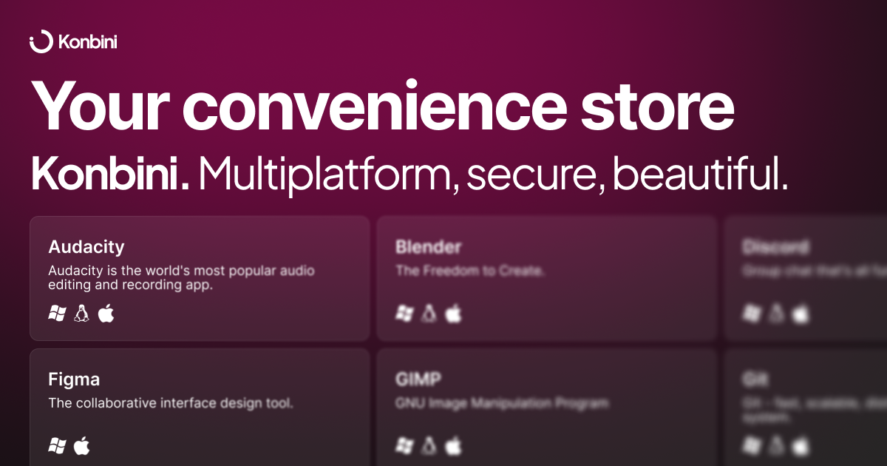

> [!CAUTION]
> **THIS IS NOT RELEASE READY.** Do not download releases, they're not expected to work properly.

# Konbini &middot;  &middot;  &middot;  &middot; 

> Konbini, Your convenience store.

Konbini is a package manager and software center meant to provide the most easy, beautiful, and straightforward experience to both users and developers.

## What makes Konbini better?

### Easiness for devs

Bureaucracy-less publishing. You only need _one_ Pull Request to register as a developer, then _one_ Pull Request to publish your package. Any update you publish will be instantly available (if you publish correctly, of course, which is also easy). No need for making another PR for each version like WinGet or Nix do.

### Universality

Aliasing, a feature unique to Konbini, lets you have WinGet, Nix, APT, or Homebrew packages available from Konbini. This way, if the user attempts to install the package, it'll be automatically installed with the package manager that should be used instead, and will let it manage updates. The main reason for doing this is that you'll get a frontend link (for our store) to share with your users.

### Safety

Konbini requires all executables to be digitally signed using PGP, and to be hashed using the SHA3-512 hashing algorithm, ensuring secure distribution. These can be generated using Konbini itself, via `kbi sign` and `kbi hash` respectively.

Furthermore, we periodically scan every package with antivirus software in a transparent manner. [More onto this here](./packages/client/guard/README.md).

### Availability

Konbini removes the need to use different publishing methods depending on the platform, by supporting all major platforms, including both x64 and ARM in macOS and Linux.

## Usage

### Command Line Interface

Run `kbi` once installed and you will be shown a list of available commands and a brief description of what do they do.

Developers must compile (via `bun run build`) Konbini before execution - this is because Konbini relies on elevation in order to function, so `bun . <command>` usually won't work as it should.

### Graphical User Interface

Head to `https://konbini.vercel.app`. It's just a frontend, similar to Flathub, you'll still need the [CLI to be installed](#command-line-interface) anyway.

## Credits

Konbini is brought to you by [@ZakaHaceCosas](https://github.com/ZakaHaceCosas) and published under the name of "Hana" (this GitHub organization and a yet-to-be-born company).

A huge "thank you" to [MrSerge01](https://github.com/MrSerge01), [Dimkauzh](https://github.com/dimkauzh), and especially [pico190](https://github.com/pico190) for helping out.

## License

_Konbini, your convenience store._
Copyright (C) 2025 Zakaria ("ZakaHaceCosas", under "Hana" org.)

This program is free software: you can redistribute it and/or modify
it under the terms of the GNU Affero General Public License as
published by the Free Software Foundation, either version 3 of the
License, or (at your option) any later version.

This program is distributed in the hope that it will be useful,
but WITHOUT ANY WARRANTY; without even the implied warranty of
MERCHANTABILITY or FITNESS FOR A PARTICULAR PURPOSE. See the
GNU Affero General Public License for more details.

You should have received a copy of the GNU Affero General Public License
along with this program. If not, see <https://www.gnu.org/licenses/>.
