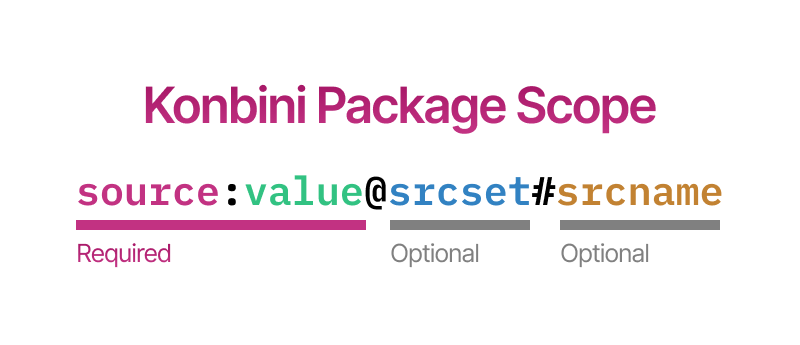
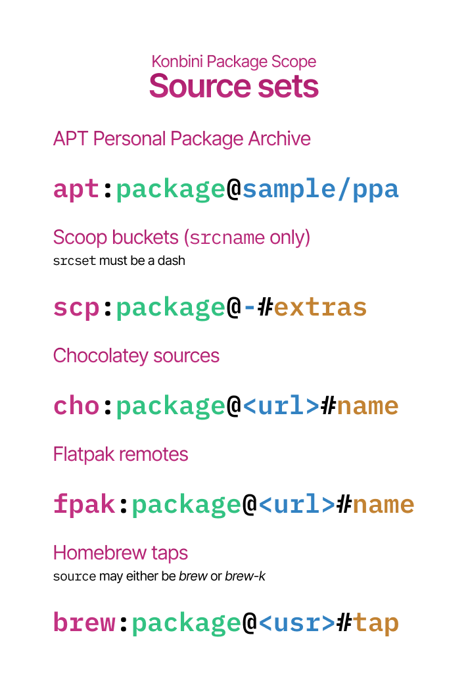

# Konbini Package Scopes

A scope is defined in the `SOURCE:VALUE` (or `SOURCE:VALUE@SOURCE_SET`) format. You define one scope per platform (either Linux 64, Linux ARM, macOS 64, macOS ARM, or Windows 64).

It follows this syntax:

Where the `source:value` component is required, and the `srcset#srcname` (joint to the aforementioned by an `@`) is optional. Inside it, the `#srcname` itself is optional, being `source:value@srcset` valid.

## KPS Package Source (`source`)

The `SOURCE` (prefix to the scope) can be any of these strings:

| Source   | Meaning                               | Supports source setting |
| -------- | ------------------------------------- | ----------------------- |
| `kbi`    | **Konbini**                           | Not needed              |
| `apt`    | DPKG                                  | Only PPAs               |
| `nix`    | Nix                                   | No                      |
| `brew`   | Homebrew                              | Yes                     |
| `brew-k` | Homebrew, packages that need `--cask` | Yes                     |
| `fpak`   | Flatpak                               | Yes                     |
| `wget`   | WinGet                                | No                      |
| `scp`    | Scoop                                 | Yes                     |
| `cho`    | Chocolatey                            | Yes                     |
| `snap`   | SnapCraft                             | No                      |

## KPS Package Value (`value`)

This value differs depending on the KPS source.

### If KPS source equals "kbi"

**The FILENAME of the binary associated with that scope.** Since we grab binaries from your GitHub/GitLab/Codeberg release, you specify the filename we should look for.

**If you write version codes in your file names**, you don't need to modify the manifest each time, don't worry. Use `[[VER]]` in the manifest to reference the place where it appears (we assume your naming is consistent, as it should be). Be sure the version is equal to your release's `tag_name`.

> [!TIP]
> If your executable is called `my-program-v2.0.0.exe`, the scope should be `kbi:my-program-[[VER]].exe` and your release's tag name should be exactly "`v2.0.0`". Do this for every platform scope you plan to add.

### If KPS source equals anything else

**The PACKAGE NAME as defined in the package manager denoted by the SOURCE itself**. This must be the same unique name used for identifying the package when using the corresponding package manager.

So, if your package is usually installed via `sudo apt install my-program`, for example, your KPS value should equal `my-program`.

---

By supporting all scopes, Konbini instantly becomes a superset of `apt`, `nix`, `brew`, `flatpak`, and `winget` at the same time, including packages from all registries _without needing additional setup_ - as they're trusted, and we thus do not require signatures or extra overhead.

## KPS Source Set (`srcset`) and Source Name (`srcname`)

Optionally, when aliasing packages from certain sources, you might want to specify a srcset. A good example is specifying the source for an apt-installed package that comes from a PPA.

They're supported for the following sources:

You can specify a srcset for PPAs, and a srcset+srcname for Flatpak remotes, Scoop buckets, Homebrew taps, and Chocolatey repos.

If you only need the name (like, for example, for the `extras` Scoop bucket which lacks a URL), just set the URL to a dash (`-`) and it'll be ignored.
