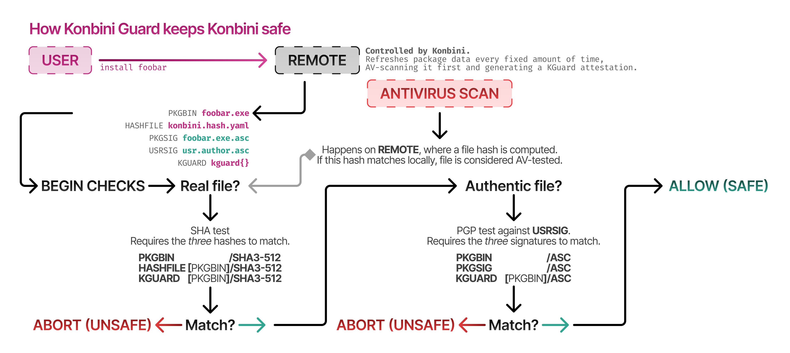

# How Konbini is kept secure

## At the moment of publishing

Packages need to be reviewed once before being accepted. We check everything we can (binaries themselves, repo, author) before allowing a package to register.

Afterwards, packages do not become immediately available. They need to undergo a [KGuard antivirus scan](../packages/guard/README.md) to check they're safe. PGP signatures and SHA hashes are also required.

## At the moment of installing

You can look at this flowchart for a well-done summary

When installing, hashes are used to assert that you're downloading binaries that went through antivirus scanning, and signatures are checked too.
