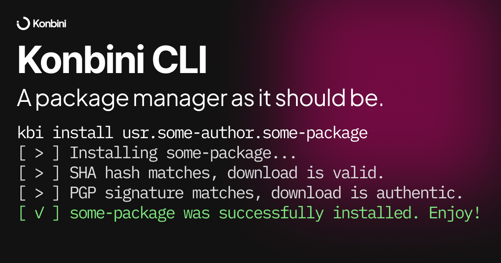

# Konbini CLI

Konbini's main CLI client. This is where everything happens.

It's built on BunJS. All code is here except for the self-updater which is at the `update` workspace (as of now, plan is to "compress" it into a shell script and embed it into the main CLI).
