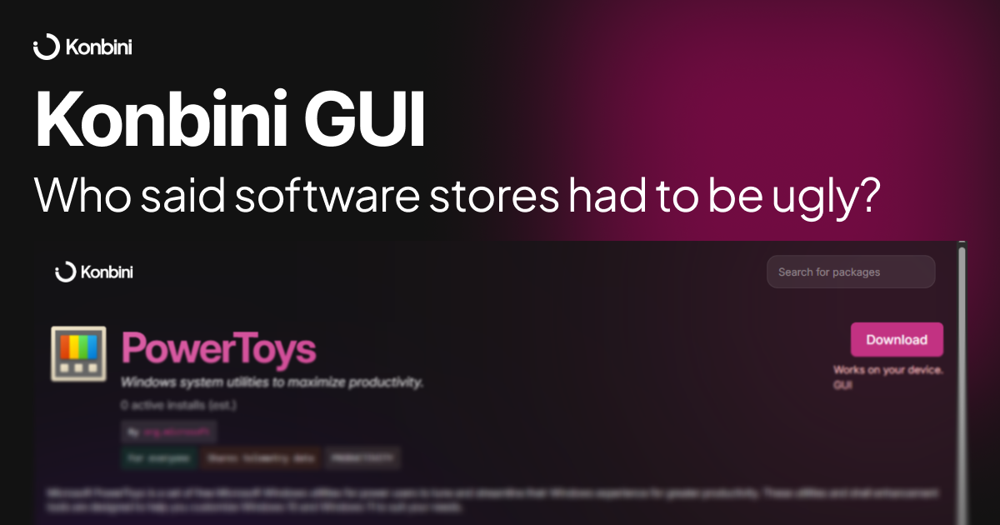

# Konbini GUI

A webapp for Konbini. Merely visual, but you've got to admit it - it just looks great when compared to most package managers (except for Flathub which does look decent).

It's built on Preact (w/ Preact ISO for routing) and runs on NodeJS & PNPM (though Bun (recommended for this project) handles it well). Just be a bit cautious when touching dependencies, and preferably don't change them when PRing.

[Hosted on Vercel, find it at this link.](https://konbini.vercel.app/)
